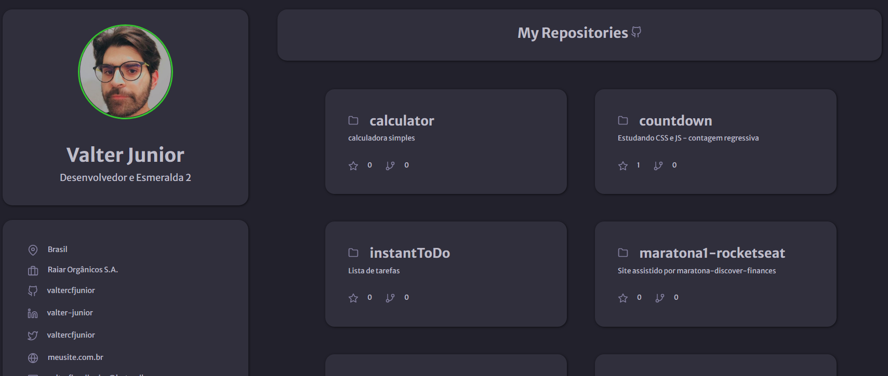
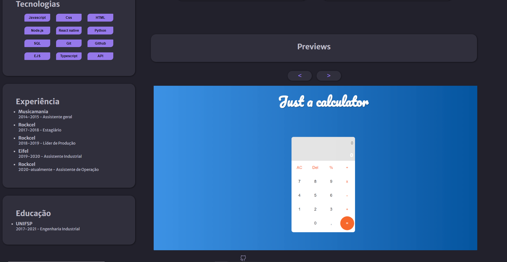

<h1 align="center">Portfólio</h1>

 🚀 Estudo de portfolio com API Github + Slider de imagens

<h1 align="center"></h1>

•
 <a href="#objetivo">Objetivo</a> •
 <a href="#tecnologias">Tecnologias</a> • 
 <a href="#autor">Autor</a> •

<h1 align="center">
    
    
</h1>

## **Objetivo**

 🔍 Treinar CSS e JS - Aprendendo sobre APIS Github e Slider de Imagens 

## **Tecnologias**

<ul>

<li>🛠 HTML
<li>🛠 CSS
<li>🛠 Javascript
<li>🛠 API Github
<li>🛠 Tiny Slider 2

</ul>

## **Autor**

 Desenvolvido por <a href="https://github.com/valtercfjunior">Valter Junior</a> 

